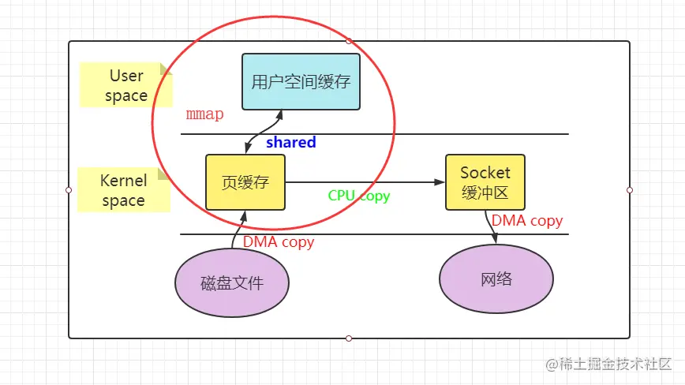
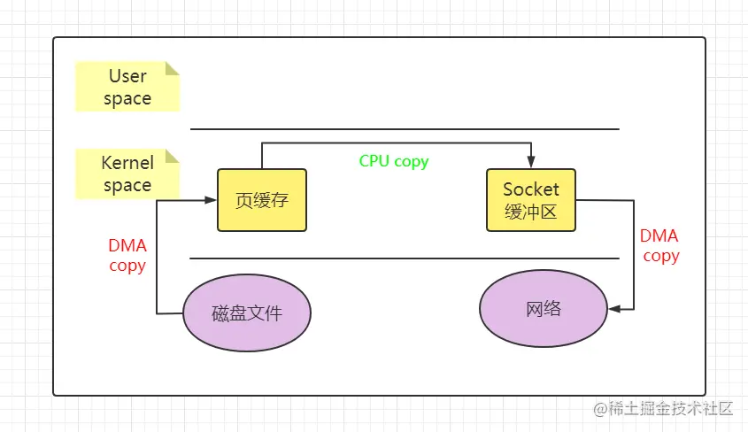

# Learning_Java_01
## Java基础

### 1. BIO & NIO & AIO
#### 1.1 BIO（同步阻塞IO）
服务器端：

**逻辑**：根据套接字创建服务器套接字对象，而后调用accept()方法将本监听线程阻塞直到客服端请求到来。收到客户端请求后，监听线程会创建新的线程与之交互并通过socket进行数据的读取和写入，数据的读取也会阻塞线程，直到内核将数据copy至用户空间。

代码实现：
```Java 
import java.io.BufferedReader;
import java.io.IOException;
import java.io.InputStreamReader;
import java.io.PrintWriter;
import java.net.ServerSocket;
import java.net.Socket;

class Server{
    public static void main(String[] args) {
        int port = 6666;
        ServerSocket serverSocket = null;
        try{
            serverSocket = new ServerSocket(port);
            System.out.println("Server started. Listening on the port "+port);

            while(true){
                Socket clientSocket = serverSocket.accept();
                System.out.println("Client connected"+clientSocket.getInetAddress() );

                new Thread(new ClientHandler(clientSocket)).start();
            }

        } catch (IOException e) {
            e.printStackTrace();
        }
    }
}


class ClientHandler implements Runnable {
    private Socket clientSocket;

    public ClientHandler(Socket clientSocket) {
        this.clientSocket = clientSocket;
    }

    @Override
    public void run() {
        try (
                BufferedReader reader = new BufferedReader(new InputStreamReader(clientSocket.getInputStream()));
                PrintWriter writer = new PrintWriter(clientSocket.getOutputStream(), true);
        ) {
            String inputLine;
            while ((inputLine = reader.readLine()) != null) {
                System.out.println("Received from client: " + inputLine);
                writer.println("Server: " + inputLine);
            }
        } catch (IOException e) {
            e.printStackTrace();
        } finally {
            try {
                clientSocket.close();
                System.out.println("Client disconnected: " + clientSocket.getInetAddress());
            } catch (IOException e) {
                e.printStackTrace();
            }
        }
    }
}
```

客户端同理。

代码实现：
```Java
import java.io.*;
import java.net.*;

public class SimpleBIOClient {
    public static void main(String[] args) {
        String serverAddress = "127.0.0.1";
        int serverPort = 8080;

        try (
            Socket socket = new Socket(serverAddress, serverPort);
            BufferedReader reader = new BufferedReader(new InputStreamReader(socket.getInputStream()));
            PrintWriter writer = new PrintWriter(socket.getOutputStream(), true);
            BufferedReader userInput = new BufferedReader(new InputStreamReader(System.in));
        ) {
            String userInputLine;
            while ((userInputLine = userInput.readLine()) != null) {
                writer.println(userInputLine);
                System.out.println("Server response: " + reader.readLine());
            }
        } catch (IOException e) {
            e.printStackTrace();
        }
    }
}

```

**缺点**：一个客户端连接请求对应一个线程，如果有大量连接请求会导致资源耗费殆尽。   
<br/>

#### 1.2 NIO（同步非阻塞IO）
处理逻辑：

**缓冲区**：临时存放数据的buffer，用来存放写入通道或者从通道中读出的数据。

**通道**：使用零拷贝技术，将数据从一个数据源传输到另一个数据源，而不需要显式的加载到内存中。然后再将这些数据写入缓冲区。在非阻塞模式下，向通道写数据或者读数据都不会阻塞当前线程。（BIO就会阻塞）

**选择器**：多路复用：使用一个线程同时管理多个通道，节省资源；事件驱动：通过检查通道的事件状态来触发操作，适用于多连接场景，例如选择器只会处理已经准备好读数据的通道，不会理会那些正在还没有准备好数据的通道。

**零拷贝技术**：思想：在数据传输过程中减少拷贝操作例如：磁盘-内存-网络缓冲区。其对比如下图所示：

<div style="text-align:center;">
通常操作
<br>


<br>
mmap/write操作
<br>


<br>
senfile操作
<br>

</div>

<br>

代码实现：
```java
import java.io.IOException;
import java.net.InetSocketAddress;
import java.nio.ByteBuffer;
import java.nio.channels.SelectionKey;
import java.nio.channels.Selector;
import java.nio.channels.ServerSocketChannel;
import java.nio.channels.SocketChannel;
import java.util.Iterator;
import java.util.Set;

public class NioSelectorExample {

  public static void main(String[] args) {
    try {
      ServerSocketChannel serverSocketChannel = ServerSocketChannel.open();
      serverSocketChannel.configureBlocking(false);
      serverSocketChannel.socket().bind(new InetSocketAddress(8080));

      Selector selector = Selector.open();
      // 将 ServerSocketChannel 注册到 Selector 并监听 OP_ACCEPT 事件
      serverSocketChannel.register(selector, SelectionKey.OP_ACCEPT);

      while (true) {
        int readyChannels = selector.select();

        if (readyChannels == 0) {
          continue;
        }

        Set<SelectionKey> selectedKeys = selector.selectedKeys();
        Iterator<SelectionKey> keyIterator = selectedKeys.iterator();

        while (keyIterator.hasNext()) {
          SelectionKey key = keyIterator.next();

          if (key.isAcceptable()) {
            // 处理连接事件
            ServerSocketChannel server = (ServerSocketChannel) key.channel();
            SocketChannel client = server.accept();
            client.configureBlocking(false);

            // 将客户端通道注册到 Selector 并监听 OP_READ 事件
            client.register(selector, SelectionKey.OP_READ);
          } else if (key.isReadable()) {
            // 处理读事件
            SocketChannel client = (SocketChannel) key.channel();
            ByteBuffer buffer = ByteBuffer.allocate(1024);
            int bytesRead = client.read(buffer);

            if (bytesRead > 0) {
              buffer.flip();
              System.out.println("收到数据：" +new String(buffer.array(), 0, bytesRead));
              // 将客户端通道注册到 Selector 并监听 OP_WRITE 事件
              client.register(selector, SelectionKey.OP_WRITE);
            } else if (bytesRead < 0) {
              // 客户端断开连接
              client.close();
            }
          } else if (key.isWritable()) {
            // 处理写事件
            SocketChannel client = (SocketChannel) key.channel();
            ByteBuffer buffer = ByteBuffer.wrap("Hello, Client!".getBytes());
            client.write(buffer);

            // 将客户端通道注册到 Selector 并监听 OP_READ 事件
            client.register(selector, SelectionKey.OP_READ);
          }

          keyIterator.remove();
        }
      }
    } catch (IOException e) {
      e.printStackTrace();
    }
  }
}

```


#### 1.3 AIO（异步IO）
基于回调技术实现。

<br>
