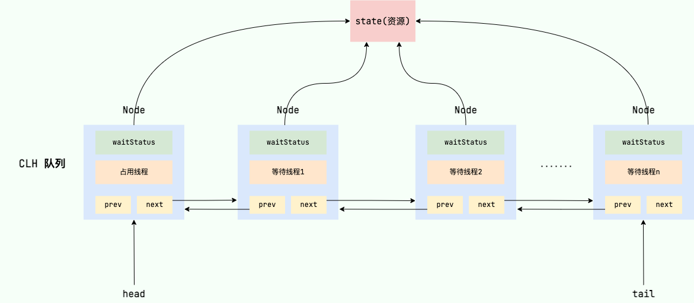
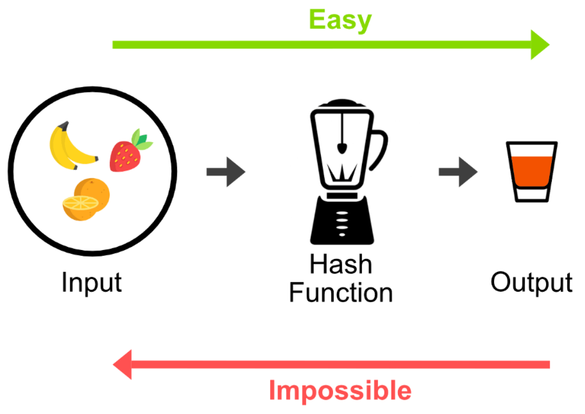
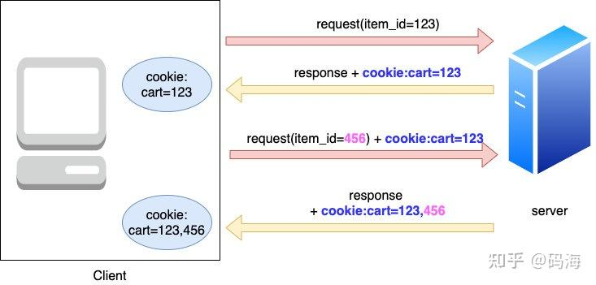

# Learning_Java_01
## Java 并发
### 1. AQS 抽象同步队列

<div style="text-align:center;">
AQS实现
<br>

</div>

AQS 使用state 表示资源使用状态，通过内置的FIFO线程等待队列来完成请求资源的线程的排队。常见的ReentrantLock、Semaphore、CountDownLatch都是基于AQS实现的。

## 计算机网络
### 1. HTTP
HTTP 协议，全称超文本传输协议（Hypertext Transfer Protocol）。顾名思义，HTTP 协议就是用来规范超文本的传输，超文本，也就是网络上的包括文本在内的各式各样的消息，具体来说，主要是来规范浏览器和服务器端的行为的。并且，HTTP 是一个无状态（stateless）、明文协议，也就是说服务器不维护任何有关客户端过去所发请求的消息。这其实是一种懒政，有状态协议会更加复杂，需要维护状态（历史信息），而且如果客户或服务器失效，会产生状态的不一致，解决这种不一致的代价更高。

***HTTP请求***：

HTTP 请求报文由客户端发送给服务器，用于请求特定资源或执行特定操作。它通常包括以下部分：

请求行（Request Line）：包含请求方法、请求的资源路径和HTTP协议版本，通常以空格分隔。

请求头部（Request Headers）：包含关于请求的元数据信息，以键值对的形式表示。请求头字段可以根据具体的需求进行添加或修改，以便与服务器进行通信.常见的请求头包括：

    Host：指定服务器的主机名和端口号。
    User-Agent：指定客户端的用户代理，通常是浏览器信息。
    Accept：指定客户端接受的响应内容类型。
    Cookie：包含客户端的 Cookie 数据。

空行：通常是一个空白行，用于分隔请求头部和请求体。

请求体（Request Body）：对于 HTTP GET 请求，通常没有请求体。但对于 POST、PUT 等请求，请求体包含了要传输给服务器的数据，如表单数据或 JSON 数据。

一个完整的HTTP请求如下所示：

```http
GET /path/to/resource HTTP/1.1
Host: www.example.com
User-Agent: Mozilla/5.0 (Windows NT 10.0; Win64; x64) AppleWebKit/537.36 (KHTML, like Gecko) Chrome/88.0.4324.190 Safari/537.36
Accept: text/html,application/xhtml+xml,application/xml;q=0.9,image/webp,image/apng,*/*;q=0.8
```

***HTTP响应***：

HTTP 响应报文由服务器发送给客户端，用于返回请求的资源或执行的操作结果。它通常包括以下部分：

状态行（Status Line）：包含响应的状态码和对应的状态消息，以空格分隔。
常见的响应状态码：

    200 OK：表示请求成功，服务器已成功处理了请求。
    301 Moved Permanently：表示请求的资源已被永久移动到新的 URL。
    302 Found：表示请求的资源已被暂时移动到新的 URL。
    404 Not Found：表示服务器未找到请求的资源。
    500 Internal Server Error：表示服务器在处理请求时发生了错误。

响应头部（Response Headers）：包含关于响应的元数据信息，以键值对的形式表示。常见的响应头包括：

    Content-Type：指定响应内容的类型（例如，text/html、application/json）。
    Content-Length：指定响应内容的长度（以字节为单位）。
    Set-Cookie：用于设置客户端的 Cookie 数据。
空行：通常是一个空白行，用于分隔响应头部和响应体。

响应体（Response Body）：包含服务器返回的数据，可以是 HTML 页面、JSON 数据等。

``` http
HTTP/1.1 200 OK         <-- 状态行
Server: Apache/2.4.41  <-- 响应头部
Content-Type: text/html
Content-Length: 1234

<!DOCTYPE html>
<html>
<head>
    <title>Sample Page</title>
</head>
<body>
    <h1>Hello, World!</h1>
</body>
</html>              <-- 响应体
```

<br>

***HTTP 的缓存机制***

它是一种用于减少网络传输和提高网页加载速度的重要机制。缓存允许浏览器在请求某些资源时，不必每次都从服务器重新获取，而是可以从本地缓存中获取。HTTP 缓存可以分为两种类型:

强缓存：强缓存是指浏览器在请求资源时，会先检查本地缓存是否存在该资源的副本，如果存在且尚未过期，浏览器将直接从本地缓存中获取资源，而不会向服务器发起请求。通常使用响应头中的 Cache-Control 和 Expires 字段来控制强缓存的行为。

协商缓存：如果资源的强缓存过期或未命中，浏览器会向服务器发起请求。服务器会检查请求中的条件头部字段，如 If-Modified-Since 和 If-None-Match，与服务器上的资源进行比较。如果资源没有发生变化，服务器返回 304 Not Modified 响应，告诉浏览器可以继续使用本地缓存。如果资源发生了变化，服务器将返回新的资源内容。
<br>


***HTTP断点续传***

HTTP断点续传是一种机制，允许客户端在下载大文件时，可以选择从已下载的部分继续下载，而不必重新下载整个文件。这可以显著提高下载效率，减少了网络带宽的浪费。

客户端请求文件：客户端向服务器发送 HTTP 请求，请求要下载的文件。在请求头中可以包含一个 Range 字段，用于指定从文件的哪个位置开始下载，例如：

```http
GET /file.zip HTTP/1.1
Host: example.com
Range: bytes=500-999
```

服务器响应:

服务器接收到客户端的请求后，根据 Range 字段确定要发送的文件部分。服务器会返回带有部分文件数据的 HTTP 响应，状态码通常是 206（Partial Content），并包含以下头部字段：

```http
HTTP/1.1 206 Partial Content
Content-Range: bytes 500-999/2000  <-- 表示返回的是文件的哪个部分
Content-Length: 500               <-- 表示返回的数据长度
```
客户端接收数据：客户端接收到服务器的响应后，将文件数据追加到已经下载的文件末尾。这样，文件的一部分就被成功续传了。

继续下载：如果客户端需要继续下载其他部分的文件，它可以再次发送包含适当 Range 字段的 HTTP 请求，服务器会继续发送文件的其他部分。

通过这个机制，客户端可以逐步下载大文件的各个部分，而不需要一次性下载整个文件。这对于大文件下载和网络不稳定的情况非常有用，因为它允许在下载中断后继续下载而不必重新开始。

需要注意的是，服务器必须支持断点续传，而客户端也需要能够处理部分文件数据的追加和拼接。在某些情况下，服务器和客户端之间的代理服务器也可能会影响断点续传的有效性。


<br>

### 2. HTTPS
HTTPS 协议（Hyper Text Transfer Protocol Secure），是 HTTP 的加强安全版本。HTTPS是基于 HTTP 的，也是用 TCP 作为底层协议，并额外使用 SSL/TLS 协议用作加密和安全认证。默认端口号是 443.

### 3. SSL/TLS 加密
#### 3.1 非对称加密
加密者使用公钥将要发送的消息进行加密（任何加密者都可以获取到公钥，公钥只能加密不能解密），解密者使用私钥将消息解密。公钥和私钥需要使用一种复杂的数学方法生成，开销较大。形象的描述如下：

 <div style="text-align:center;">
单向陷门函数
<br>

</div>   


#### 3.2 对称加密
加密者和解密者都共用一把钥匙，代价较低。但是由于是明文传输，钥匙会有可能被其他人获取。因此，SSL/TLS使用非对称加密来传输钥匙，使用对称加密来传输信息。

#### 3.3 CA证书

客户端C要想与服务器S通信，首先要获取到S的公钥K0并使用公钥对自己要传输的消息加密。但是此时如果有黑客H冒充S，并将自己的K1发送给C，那么C就会使用K1进行加密，H使用自己的私钥解密便可获取到传输内容。

为了公钥传输的信赖性问题，第三方机构应运而生⸺证书颁发机构（CA，Certificate Authority）。CA 默认是受信任的第三方。CA 会给各个服务器颁发证书，证书存储在服务器上，并附有 CA 的电子签名（见下节）当客户端（浏览器）向服务器发送 HTTPS 请求时，一定要先获取目标服务器的证书，并根据证书上的信息，检验证书的合法性。一旦客户端检测到证书非法，就会发生错误。客户端获取了服务器的证书后，由于证书的信任性是由第三方信赖机构认证的，而证书上又包含着服务器的公钥信息，客户端就可以放心的信任证书上的公钥就是目标服务器的公钥。

#### 3.4 总结
1. 客户端发起HTTPS请求：客户端（通常是Web浏览器）在URL中输入"https://"前缀，发起一个HTTPS请求。

2. 服务器选择加密套件：服务器接收到HTTPS请求后，会返回一个包含支持的加密算法和协议版本列表的消息。这个列表包括服务器支持的加密套件以及TLS/SSL的版本。

3. 户端选择加密套件：客户端收到服务器的加密套件列表后，会选择一个适合的加密套件来协商加密参数。这个协商过程确保客户端和服务器都使用相同的加密算法和协议。

4. 服务器的证书验证：服务器会向客户端发送一个数字证书，证书包含了服务器的公钥、证书的颁发者（CA），以及其他相关信息。客户端会验证证书的有效性，确保它没有被篡改并且是由可信任的CA颁发的。

5. 客户端生成随机密钥：客户端生成一个随机的对称密钥（Session Key），用于后续的通信加密和解密。

6. 客户端使用服务器公钥加密会话密钥：客户端使用服务器的公钥对生成的随机密钥进行加密，然后将加密后的密钥发送给服务器。

7. 服务器使用私钥解密会话密钥：服务器使用自己的私钥来解密客户端发送的随机密钥，从而获得相同的会话密钥。

8. 安全通信建立：客户端和服务器都拥有相同的会话密钥，它们使用这个密钥来加密和解密通信过程中的数据，确保数据的机密性和完整性。

9. 数据传输：在安全通信通道建立后，客户端和服务器开始传输数据，所有传输的数据都会在发送和接收时进行加密和解密。

10. 结束会话：一旦通信结束，会话密钥通常会被销毁，以保护通信的安全性

### 4. 访问一个网站会进行哪些操作？

1. DNS解析（UDP）：您的浏览器首先会解析输入的域名（如www.example.com）以获取相应的IP地址。它会查询本地DNS缓存以查找已解析的地址，如果没有找到，则会向DNS服务器发送请求，该服务器可能会在全球分布的DNS服务器层次结构中查找域名并返回IP地址。

2. 建立TCP连接：一旦浏览器知道服务器的IP地址，它会尝试建立与该服务器的TCP连接。这个过程通常包括三次握手，用于确保连接的可靠性和数据传输的完整性。

3. 发起HTTP请求：一旦TCP连接建立，浏览器会向服务器发送一个HTTP请求，该请求包含关于所需资源（如网页、图像、样式表等）的信息。这个请求将被发送到服务器的特定端口（通常是80或443，具体取决于使用的协议，HTTP或HTTPS）。

4. 服务器处理请求：服务器收到HTTP请求后，会根据请求的内容执行相应的处理。这可能涉及访问数据库、生成动态内容、验证用户身份等等。服务器还会构建HTTP响应，其中包含了请求的资源或其他信息。

5. 发送HTTP响应：服务器构建完HTTP响应后，它将响应通过之前建立的TCP连接发送回浏览器。

6. 浏览器接收响应：浏览器接收到来自服务器的HTTP响应，它会根据响应的状态码（如200表示成功，404表示未找到，等等）来确定请求是否成功。

7. 浏览器渲染：浏览器接收到 HTTP 响应后，会根据响应内容进行页面渲染。如果响应内容是 HTML 页面，浏览器会解析 HTML，构建 DOM 树，然后根据 DOM 树和 CSS 样式表进行页面布局和绘制，最终将页面呈现在用户的浏览器窗口中。

8. 页面加载资源：HTML 页面通常包含了对其他资源的引用，如图片、样式表、JavaScript 文件等。浏览器会根据 HTML 中的链接和标签，向服务器请求这些资源，然后将它们加载到页面中。

9. 执行 JavaScript：如果页面包含了 JavaScript，浏览器会执行 JavaScript 代码，实现交互和动态效果。

10. 渲染完成：当页面的所有资源都加载完成，JavaScript 执行完毕，页面渲染完毕，用户就可以看到最终的页面

### 5. TCP 
**三次握手**：

1.第一次握手：Client 什么都不能确认；Server 确认了对方发送正常，自己接收正常。

2.第二次握手：Client 确认了：自己发送、接收正常，对方发送、接收正常；Server 确认了：对方发送正常，自己接收正常。

3.第三次握手：Client 确认了：自己发送、接收正常，对方发送、接收正常；Server 确认了：自己发送、接收正常，对方发送、接收正常。

**四次挥手**：

TCP 是全双工通信，可以双向传输数据。任何一方都可以在数据传送结束后发出连接释放的通知，待对方确认后进入半关闭状态。当另一方也没有数据再发送的时候，则发出连接释放通知，对方确认后就完全关闭了 TCP 连接。举个例子：

A 和 B 打电话，通话即将结束后。
1. 第一次挥手：A 说“我没啥要说的了”
2. 第二次挥手：B 回答“我知道了”，但是 B 可能还会有要说的话，A 不能要求 B 跟着自己的节奏结束通话
3. 第三次挥手：于是 B 可能又巴拉巴拉说了一通，最后 B 说“我说完了”
4.  第四次挥手：A 回答“知道了”，这样通话才算结束。

**如何确保可靠传输**：
1. 基于数据块传输：应用数据被分割成 TCP 认为最适合发送的数据块，再传输给网络层，数据块被称为报文段或段。
2. 对失序数据包重新排序以及去重：TCP 为了保证不发生丢包，就给每个包一个序列号，有了序列号能够将接收到的数据根据序列号排序，并且去掉重复序列号的数据就可以实现数据包去重。
3. 校验和 : TCP 将保持它首部和数据的检验和。这是一个端到端的检验和，目的是检测数据在传输过程中的任何变化。如果收到段的检验和有差错，TCP 将丢弃这个报文段和不确认收到此报文段。
4. 超时重传 : 当发送方发送数据之后，它启动一个定时器，等待目的端确认收到这个报文段。接收端实体对已成功收到的包发回一个相应的确认信息（ACK）。如果发送端实体在
合理的往返时延（RTT）内未收到确认消息，那么对应的数据包就被假设为已丢失并进行重传。
5. 流量控制 : TCP连接的每一方都有固定大小的缓冲空间，TC 的接收端只允许发送端发送接收端缓冲区能接纳的数据。当接收方来不及处理发送方的数据，能提示发送方降低发送的速率，防止包丢失。TCP 使用的流量控制协议是可变大小的滑动窗口协议（TCP 利用滑动窗口实现流量控制）。
6. 拥塞控制 : 当网络拥塞时，减少数据的发送。

 <div style="text-align:center;">
拥塞控制：慢开始-拥塞避免-快重传-快恢复
<br>

</div>   

**粘包和拆包问题**

1. TCP粘包问题： 当发送端连续发送多个小数据包时，接收端有可能会将它们合并成一个大的数据包接收，从而导致粘包问题。这种情况下，接收端无法准确区分每个小数据包的边界。假设发送方连续发送两个消息：
"Hello, "
"World!"
由于网络传输的不确定性，接收方可能会在同一个接收缓冲区中收到这两个消息的组合，如下所示：
"Hello, World!"
这就是典型的粘包问题，接收方无法准确判断消息的界限，因此无法正确解析和处理这两个消息。

2. TCP拆包问题： 与粘包问题相反，拆包问题发生在接收端将一个大数据包拆分成多个小数据包时。这也会导致接收端无法准确还原原始数据包。

3. 解决办法：
固定长度消息： 在消息中包含固定长度的消息头，消息头中指定了消息体的长度，接收方根据消息头中的长度信息来正确划分消息；
消息分隔符： 使用特定的分隔符（如换行符 \n、回车符 \r 等）来分隔不同的消息。接收方根据分隔符将数据分成多个消息；
消息头部信息： 在消息中包含头部信息，头部信息中包含了消息的元信息，如消息类型、长度等。接收方根据头部信息来正确解析消息；
消息定界符： 在消息的开头或结尾添加特定的定界符，用于标识消息的边界。

### 6. 端口号
系统端口（Well-known Ports）：这些端口号范围从0到1023，通常由系统或操作系统保留，用于常见的网络服务，如HTTP（端口80）、HTTPS（端口443）、FTP（端口21）等。

注册端口（Registered Ports）：这些端口号范围从1024到49151，通常由各种应用程序或服务使用，但没有被标准化。一些常见的应用程序可能会使用这些端口，但它们不属于系统端口。

动态或私有端口（Dynamic or Private Ports）：这些端口号范围从49152到65535，通常用于临时或私有网络连接。客户端应用程序通常会在此范围内选择临时端口来建立与服务器的连接。

### 7. ARP协议
ARP 协议，全称 地址解析协议（Address Resolution Protocol），它解决的是网络层地址和链路层地址之间的转换问题。因为一个 IP 数据报在物理上传输的过程中，总是需要知道下一跳（物理上的下一个目的地）该去往何处，但 IP 地址属于逻辑地址，而 MAC 地址才是物理地址，ARP 协议解决了 IP 地址转 MAC 地址的一些问题。

### 8. GET POST

GET 和 POST 是 HTTP 请求方法，它们用于与服务器进行通信，但在用途和特点上有一些重要的区别：

1. **语义差异**：
   - **GET**：用于从服务器获取资源，通常是请求数据，不应该对服务器产生任何副作用。GET 请求参数通常附在 URL 上，可见于浏览器地址栏。例如搜索引擎的查询操作可以是 GET 请求，如 https://www.google.com/search?q=keyword。
   - **POST**：用于向服务器提交数据，通常是上传数据或者在服务器上创建新的资源。POST 请求的数据通常包含在请求体中，不会在 URL 上显示。例如：用户登录，输入账号和密码。

2. **数据传递方式**：
   - **GET**：数据通过 URL 的查询字符串传递，对参数长度和数据类型有限制。
   - **POST**：数据通过请求体传递，允许传递大量数据，不受长度和数据类型限制。

3. **安全性**：
   - **GET**：由于参数可见于 URL，不适合传递敏感信息，如密码等。也不适合对服务器进行状态修改。
   - **POST**：适合传递敏感信息和进行状态修改，因为请求体中的数据对于用户来说不可见。

4. **幂等性**：
   - **GET**：多次发送相同的 GET 请求应该不会对服务器产生不同的影响，即具有幂等性。
   - **POST**：多次发送相同的 POST 请求可能会对服务器产生不同的影响，不具有幂等性。（涉及到修改服务器数据）

5. **缓存**：
   - **GET**：默认可被缓存，因为幂等性原因，GET的响应可以被浏览器缓存，代理服务器缓存以提升性能。
   - **POST**：默认情况下不可被缓存，因为不是幂等的，它通常会对服务器状态产生影响，除非明确指定可以缓存。

6. **适用场景**：
   - **GET**：适用于获取资源、搜索、浏览等无副作用的操作。
   - **POST**：适用于提交表单、上传文件、进行状态修改等需要传递数据和可能产生副作用的操作。

总之，GET 和 POST 有不同的用途和特点，开发者根据具体需求选择适当的请求方法来与服务器进行通信。合理使用这两种请求方法有助于构建安全、高效的网络应用。

### 9. Cookie 和Session
由于HTTP是无状态的，因此它无法记录历史操作。例如用户登陆购物网站之后，再向购物车添加一件商品时，服务器已经不知道是哪个用户了。为了解决这个问题提出了Cookie：

以加入购物车为例，每次浏览器请求后 server 都会将本次商品 id 存储在 Cookie 中返回给客户端，客户端会将 Cookie 保存在本地，下一次再将上次保存在本地的 Cookie 传给 server 就行了，这样每个 Cookie 都保存着用户的商品 id，购买记录也就不会丢失了
 <div style="text-align:center;">
使用Cookie的操作
<br>

</div>   
随着商品越加越多Cookie需要记录的数据也会越来越多，既然购物车数据也会再服务器端保留，所以只需添加能识别用户信息的Cookie就行。于是提出了Session的解决方法。

首先用户登录，server 会为用户生成一个 session，为其分配唯一的 sessionId，这个 sessionId 是与某个用户绑定的，也就是说根据此 sessionid（假设为 abc） 可以查询到它到底是哪个用户，然后将此 sessionid 通过 cookie 传给浏览器之后浏览器的每次添加购物车请求中只要在 cookie 里带上 sessionId=abc 这一个键值对即可，server 根据 sessionId 找到它对应的用户后，把传过来的商品 id 保存到 server 中对应用户的购物车即可。

Cookie（HTTP Cookie）和Session都是用于在Web应用程序中跟踪用户状态和存储数据的机制，但它们有一些关键区别：

1. **存储位置：**
   - **Cookie：** Cookie是存储在客户端（用户浏览器）的小型文本文件。每当用户与服务器进行HTTP通信时，浏览器都会将相关Cookie发送给服务器。
   - **Session：** Session数据通常存储在服务器上，而不是在客户端。服务器为每个用户创建一个唯一的Session对象，用于存储用户的状态和数据。

2. **容量：**
   - **Cookie：** Cookie通常受到浏览器的限制，每个Cookie的存储容量通常不超过4KB。
   - **Session：** Session通常可以存储更大量的数据，因为它们存储在服务器上，受服务器硬件和配置的限制。

3. **生命周期：**
   - **Cookie：** Cookie可以具有不同的生命周期，可以设置为会话级别（浏览器会话结束后删除）或持久性（在指定的时间内保留）。
   - **Session：** Session通常与用户的浏览器会话关联，当用户关闭浏览器时，Session数据通常会被销毁。

4. **安全性：**
   - **Cookie：** Cookie存储在客户端，因此可以被更容易地修改或窃取，因此不适合存储敏感数据。可以通过设置安全标志和HTTP Only标志来增加Cookie的安全性。
   - **Session：** Session数据存储在服务器上，对于客户端来说是不可见的，因此更安全，适合存储敏感数据。

5. **使用场景：**
   - **Cookie：** 通常用于存储较小的非敏感数据，如用户首选项、购物车中的商品数量等。
   - **Session：** 通常用于存储用户的身份验证信息、登录状态、购物车内容等较大或敏感的数据。

6. **跨浏览器问题：**
   - **Cookie：** 由于Cookie存储在客户端，因此可以在不同浏览器之间共享。
   - **Session：** Session通常在服务器上存储，因此不容易在不同浏览器之间共享。

综上所述，Cookie和Session都有各自的用途和优点，选择哪个取决于应用程序的需求和安全性要求。通常，它们也可以一起使用，以实现不同层次的数据存储和状态跟踪。


### 10. HTTP1.0/HTTP1.1/HTTP2.0/HTTP3.0

HTTP（Hypertext Transfer Protocol）是一种用于传输超文本的应用层协议。不同版本的HTTP协议有不同的特点和改进。以下是HTTP 1.0、HTTP 1.1、HTTP 2.0和HTTP 3.0的主要区别：

1. **HTTP 1.0：**
   - HTTP 1.0是最早的HTTP版本，于1996年发布。
   - 采用简单的请求/响应模型，每个请求都需要打开一个新的连接，请求完成后关闭连接。
   - 不支持持久连接，每个请求/响应都需要建立新的TCP连接，性能较差。
   - 不支持请求头部压缩，导致较大的数据传输开销。
   - 不支持流式传输，只能按照请求的顺序依次传输。

2. **HTTP 1.1：**
   - HTTP 1.1于1997年发布，广泛使用。
   - 引入了持久连接（Keep-Alive），允许在单个连接上传输多个请求和响应，减少了连接建立和关闭的开销。
   - 支持请求头部压缩（gzip、deflate等），减小了传输数据的大小。
   - 引入了管道化（Pipeline）技术，允许客户端发送多个请求，但响应仍然需要按照请求的顺序发送。
   - 性能较HTTP 1.0有显著改进，但仍然存在性能瓶颈，如队头阻塞（Head-of-Line Blocking）问题。

3. **HTTP 2.0：**
   - HTTP 2.0于2015年发布，通过二进制协议、头部压缩和多路复用等特性提高了性能。
   - 引入了多路复用（Multiplexing）技术，允许多个请求/响应在一个连接上同时传输，解决了队头阻塞问题。
   - 使用二进制格式传输数据，减小了数据大小和传输开销。
   - 支持服务器推送（Server Push），服务器可以预测客户端的需求并提前发送资源。
   - 更高的性能和更低的延迟，适合移动设备和高速网络。

4. **HTTP 3.0：**
   - HTTP 3.0是最新版本，于2020年发布，基于QUIC（Quick UDP Internet Connections）协议。
   - 完全基于UDP而不是TCP，减少了连接建立和关闭的时延。
   - 引入了更多的加密保护，增强了安全性。
   - 支持多路复用、头部压缩和服务器推送等HTTP 2.0特性。
   - 具有更好的性能和可伸缩性，适用于现代网络环境。

<br>

### 11. HTTP Keep-Alive 长连接的底层原理

- HTTP Keep-Alive 是通过在 HTTP 头部添加 `Connection: keep-alive` 字段来实现的。
- 当客户端和服务器都支持 Keep-Alive 时，TCP 连接在处理完一个请求后不会立即关闭，而是保持打开状态，等待可能的后续请求。
- 服务器可以在响应头部中添加 `Connection: keep-alive` 字段以告知客户端它支持保持连接。
- 这样，客户端可以在同一连接上发送多个请求，而无需为每个请求都重新建立 TCP 连接，减少了连接的建立和断开开销，提高了性能。

<br> 

### 12. **HTTP/2 头部压缩原理：**
- HTTP/2 使用了 HPACK 压缩算法对头部进行压缩，以减小传输的数据量。
- 压缩原理基于以下两个概念：静态表（Static Table）和动态表（Dynamic Table）。
- **静态表：** 静态表包含了一组常见的HTTP头部字段和值的索引，这些索引是固定的，不会变化。客户端和服务器都可以引用静态表中的索引，减少了重复传输的开销。
- **动态表：** 动态表用于存储请求和响应中的头部字段和值，这些字段和值是动态添加的。动态表的大小是有限的，当表满时，必须删除旧的条目来容纳新的条目。
- 在 HPACK 中，头部字段和值都使用 Huffman 编码来压缩，以进一步减小传输大小。
- 通过静态表、动态表和 Huffman 编码，HTTP/2 能够高效地压缩头部数据，减少了网络传输的数据量，提高了性能。

HTTP/2 头部压缩的实现机制比较复杂，但它能够显著减小数据大小，提高页面加载速度，特别适用于现代网络环境。

<br>

### 13. HTTP 有哪些请求方法

除了常见的GET和POST请求方法，HTTP还定义了其他一些请求方法，每种方法都有特定的用途和语义。以下是一些常见的HTTP请求方法及其作用：

1. **GET**：用于从服务器获取资源，通常是读取数据。它是幂等的，多次重复的GET请求不应该对服务器产生副作用。

2. **POST**：用于向服务器提交数据，通常用于创建新资源或执行对资源的非幂等操作。POST请求可能会对服务器产生副作用。

3. **PUT**：用于更新或创建指定资源。通常是幂等的，即多次重复的PUT请求不会产生不同的结果。

4. **DELETE**：用于删除指定资源。DELETE请求是幂等的，但是删除后再次DELETE同一资源将不再产生任何效果。

5. **PATCH**：用于对资源进行部分修改。通常用于减少带宽和减少服务器负担，只更新资源的部分属性。

6. **HEAD**：类似于GET请求，但服务器只返回响应头部信息，不返回实际内容。通常用于检查资源的元数据或验证资源是否存在。

7. **OPTIONS**：用于获取目标资源所支持的通信选项。客户端可以使用OPTIONS请求来查看服务器支持的HTTP方法、头信息等。

8. **CONNECT**：用于建立网络连接，通常用于代理服务器，以创建到目标资源的隧道。

9. **TRACE**：用于追踪请求-响应的传输路径。通常用于诊断和调试。


# 数据库

## 1 基础知识
### 1.1 ER图
ER 图 全称是 Entity Relationship Diagram（实体联系图），提供了表示实体类型、属性和联系的方法。
ER 图由下面 3 个要素组成：

**实体**：通常是现实世界的业务对象，当然使用一些逻辑对象也可以。比如对于一个校园管理系统，会涉及学生、教师、课程、班级等等实体。在 ER 图中，实体使用矩形框表示。

**属性**：即某个实体拥有的属性，属性用来描述组成实体的要素，对于产品设计来说可以理解为字段。在 ER 图中，属性使用椭圆形表示。

**联系**：即实体与实体之间的关系，在 ER 图中用菱形表示，这个关系不仅有业务关联关系，还能通过数字表示实体之间的数量对照关系。例如，一个班级会有多个学生就是一种实体间的联系。

下图是一个学生选课的 ER 图，每个学生可以选若干门课程，同一门课程也可以被若干人选择，所以它们之间的关系是多对多（M: N）。另外，还有其他两种实体之间的关系是：1 对1（1: 1）、1 对多（1: N）。

 <div style="text-align:center;">
实体关系图
<br>

</div>

<br>

### 1.2 数据库三范式

1NF(第一范式)：属性不可再分。

2NF(第二范式)：1NF 的基础之上，确保表中的每列都和主键相关，而不能只与主键的某一部分相关（主要针对联合主键而言）。
比如要设计一个订单信息表，因为订单中可能会有多种商品，所以要将订单编号和商品编号作为数据库表的联合主键，如下表所示。
 <div style="text-align:center;">
违反第二范式的场景
<br>

</div>

这样就产生一个问题：这个表中是以订单编号和商品编号作为联合主键。这样在该表中商品名称、单位、商品价格等信息不与该表的主键相关，而仅仅是与商品编号相关。所以在这里违反了第二范式的设计原则。应该改为：

 <div style="text-align:center;">
符合第二范式正确场景
<br>

</div>


3NF(第三范式)：3NF 在 2NF 的基础之上，需要确保数据表中的每一列数据都和主键直接相关，而不能间接相关。

