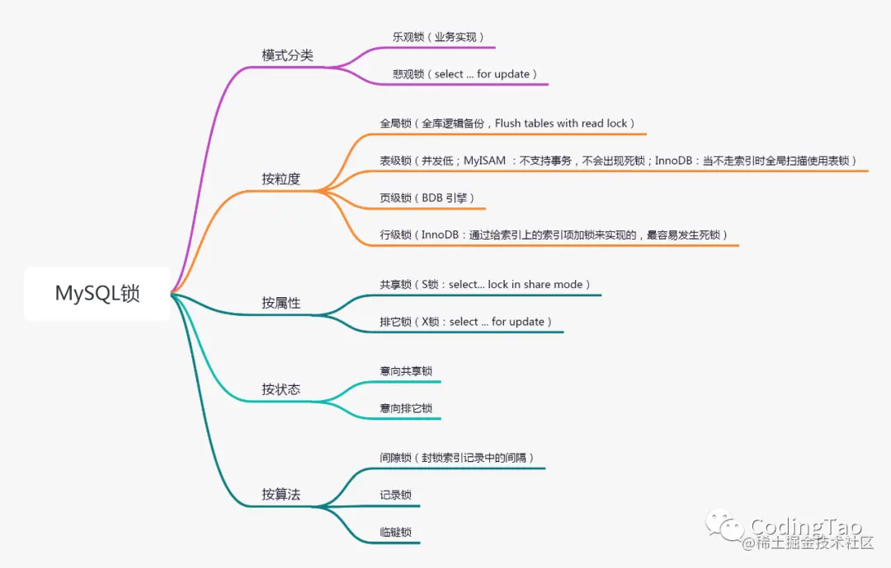

# Learning_Java_05
## MySQL
### 1. B树 B+树
MySQL中的索引主要使用B树（或B+树）数据结构来实现。下面简要介绍B树和B+树的原理以及它们之间的区别。

**B树（Balanced Tree）**：

1. **原理**：B树是一种平衡的多路搜索树，它的每个节点可以包含多个子节点，通常用于磁盘存储系统。B树的每个节点可以包含大量的键值对，从而减少了树的高度，加速了查找速度。

2. **特点**：
   - 每个节点包含的键值对数量范围是 [m/2, m]，其中m是树的阶数。
   - 所有叶子节点在同一层级。
   - 插入和删除操作可能需要进行节点的拆分和合并，以保持树的平衡。
   - 所有节点的关键字是有序排列的，节点会存储指针信息。

**B+树（Balanced Plus Tree）**：

1. **原理**：B+树也是一种平衡的多路搜索树，类似于B树，但在一些方面有所不同。B+树主要用于数据库索引结构。

2. **特点**：
   - 所有数据都存储在叶子节点中，非叶子节点只包含索引。
   - 叶子节点之间通过指针相连，形成了一个有序链表，方便范围查询。
   - 非叶子节点的子节点范围是 [ceil(m/2), m]，其中m是树的阶数。
   - B+树的平衡维护更简单，插入和删除操作通常只需调整叶子节点。

**B树与B+树的区别**：

1. **数据存储**：在B树中，数据可以存储在任何节点中，包括非叶子节点。而在B+树中，所有数据都存储在叶子节点中，非叶子节点只包含索引，这使得B+树更适合数据库索引。

2. **范围查询**：由于B+树的叶子节点之间形成有序链表，B+树更适合范围查询操作，因为可以通过链表轻松访问范围内的数据。

3. **平衡维护**：B+树的平衡维护相对简单，插入和删除操作通常只需调整叶子节点。而在B树中，插入和删除操作可能需要进行非叶子节点的拆分和合并。

4. **非叶子节点存储**：B树的非叶子节点可以存储数据，而B+树的非叶子节点只存储索引，这导致了B+树更适合数据库系统，因为索引通常比实际数据小。

总的来说，B+树更适合用于数据库索引，而B树在其他领域仍然有其应用。在数据库系统中，B+树的特点使得它更适合支持范围查询、范围扫描和排序等操作。

### 2. 事务（ACID）

MySQL的事务支持ACID特性，ACID是指原子性（Atomicity）、一致性（Consistency）、隔离性（Isolation）和持久性（Durability）。以下是MySQL事务的ACID特性的解释：

1. **原子性（Atomicity）**：
   - 原子性确保事务中的所有操作要么全部成功执行，要么全部失败。
   - 如果事务中的任何一个操作失败，系统将撤销所有已执行的操作，回滚事务，以确保数据库的一致性。

2. **一致性（Consistency）**：
   - 一致性要求事务在开始和结束时，数据库从一个一致的状态转移到另一个一致的状态。
   - 这意味着事务在执行期间不会破坏数据库的完整性约束，例如唯一键、外键等。

3. **隔离性（Isolation）**：
   - 隔离性确定了同时运行多个事务时，一个事务的执行不会受到其他事务的干扰。
   - MySQL支持多种隔离级别，如读未提交、读提交、可重复读和串行化，每个级别提供不同程度的隔离。

4. **持久性（Durability）**：
   - 持久性确保一旦事务成功提交，其结果将永久保存在数据库中，即使系统崩溃也不会丢失。
   - 数据库使用事务日志等机制来实现持久性。

MySQL使用事务引擎来管理事务，最常见的事务引擎是InnoDB。InnoDB提供了强大的事务支持，并且默认启用了事务。使用`BEGIN`或`START TRANSACTION`开始一个事务，使用`COMMIT`提交事务，或者使用`ROLLBACK`回滚事务。通过使用事务，MySQL确保了数据的完整性和一致性，从而满足ACID特性的要求。

### 3. MySQL如何实现事物的ACID特性的（使用MVCC）

MVCC是在并发访问数据库时，通过对数据做多版本管理，避免因为写数据时要加写锁而阻塞读取数据的请求，造成写数据时无法读取数据的问题。

1、读操作（SELECT）：

当一个事务执行读操作时，它会使用**快照读**取。快照读取是基于事务开始时数据库中的状态创建的，因此事务不会读取其他事务尚未提交的修改。具体工作情况如下：
对于读取操作，事务会查找符合条件的数据行，并选择符合其事务开始时间的数据版本进行读取。如果某个数据行有多个版本，事务会选择不晚于其开始时间的最新版本，确保事务只读取在它开始之前已经存在的数据。事务读取的是快照数据，因此其他并发事务对数据行的修改不会影响当前事务的读取操作。

2、写操作（INSERT、UPDATE、DELETE）：

当一个事务执行写操作时，它会生成一个新的数据版本，并将修改后的数据写入数据库。具体工作情况如下：

对于写操作，事务会为要修改的数据行创建一个新的版本，并将修改后的数据写入新版本。新版本的数据会带有当前事务的版本号，以便其他事务能够正确读取相应版本的数据。原始版本的数据仍然存在，供其他事务使用快照读取，这保证了其他事务不受当前事务的写操作影响。

3、事务提交和回滚：

当一个事务提交时，它所做的修改将成为数据库的最新版本，并且对其他事务可见。

当一个事务回滚时，它所做的修改将被撤销，对其他事务不可见。

4、版本的回收：

为了防止数据库中的版本无限增长，MVCC 会定期进行版本的回收。回收机制会删除已经不再需要的旧版本数据，从而释放空间。

使用MVCC方法实现不同的隔离级别：

1. 读未提交（Read Uncommitted）：在这个隔离级别下，事务可以读取其他事务尚未提交的数据。MVCC实现这一级别的方式是，读取时不检查数据的版本，因此可以读取到其他事务未提交的修改。

2. 读已提交（Read Committed）：在这个隔离级别下，事务只能读取已经提交的数据版本。当一个事务开始读取数据时，它只能看到其他已提交事务的更改，不会看到未提交事务的更改。当有事务提交后，再次读取时会重新获取该数据的版本记录情况从而出现不可重读的情况。

3. 可重复读（Repeatable Read）：在这个隔离级别下，事务在整个事务期间能够看到一致的数据版本。MVCC通过在事务开始时创建一个快照来实现这一级别，该快照包含了事务开始时数据库中的数据版本，而后续操作也不再是重新获取该数据的版本信息。因此，在整个事务中，事务只能看到该快照中的数据，而不受其他事务的影响。

4. 串行化（Serializable）：在这个最高级别的隔离级别下，事务是串行执行的，不允许并发。这是通过强制事务排队执行以避免并发冲突来实现的。

在 InnoDB 存储引擎中，多版本控制 (multi versioning)open in new window 就是对非锁定读的实现。如果读取的行正在执行 DELETE 或 UPDATE 操作，这时读取操作不会去等待行上锁的释放。相反地，InnoDB 存储引擎会去读取行的一个快照数据，对于这种读取历史数据的方式，我们叫它快照读 (snapshot read)在 Repeatable Read 和 Read Committed 两个隔离级别下，如果是执行普通的 select 语句（不包括 select ... lock in share mode ,select ... for update）则会使用 一致性非锁定读（MVCC）。并且在 Repeatable Read 下 MVCC 实现了可重复读和防止部分幻读。

https://zhuanlan.zhihu.com/p/52977862

###  4.MySQL 聚集索引 (主键索引) 和非聚集索引 (辅助索引/普通索引) 的区别

二者都基于B+树实现。

聚集索引：每张表只能有一个聚集索引。聚集索引决定了数据表中数据的物理存储顺序，即数据行的排列顺序与聚集索引的排序顺序一致。通常，聚集索引会被设置为表的主键，但不是强制性的。聚集索引的叶子节点包含了实际数据。

一张表可以有多个非聚集索引。非聚集索引存储了索引字段的值和指向实际数据行的指针，这些指针指向聚集索引中的对应行。

### 5. MySQL锁类型

 <div style="text-align:center;">
锁分类
<br>

</div>


1. **共享锁（Shared Lock）**：也称为读锁（Read Lock）。多个事务可以同时获得共享锁，用于读取数据，但不允许任何事务获取排它锁。共享锁不阻塞其他共享锁，但会阻塞排它锁。

```sql
select …lock in share mode。
```

2. **排它锁（Exclusive Lock）**：也称为写锁（Write Lock）。只有一个事务可以获得排它锁，用于修改数据。排它锁会阻塞其他的共享锁和排它锁。MySQL InnoDB引擎默认update,delete,insert都会自动给涉及到的数据加上排他锁，select语句默认不会加任何锁类型。
```sql
select … for update
```

3. **意向锁（Intention Shared Lock）**：
意向锁是表锁，为了协调行锁和表锁的关系，支持多粒度（表锁与行锁）的锁并存。当有事务A有行锁时，MySQL会自动为该表添加意向锁，事务B如果想申请整个表的写锁，那么不需要遍历每一行判断是否存在行锁，而直接判断是否存在意向锁，增强性能。意向锁又分为意向共享锁和意向排他锁。在有行级排他锁时会自动给表加上意向排他锁，这样其他事务会直接加表锁失败，而无需遍历整个表格。

4. **记录锁（Record Lock）**：用于锁定表中的单个记录或行。可以是共享的或排它的，具体取决于事务的锁类型。

5. **表级锁（Table Lock）**：锁定整个表。表级锁可以是共享的或排它的，具体取决于锁类型。

6. **行级锁（Row-Level Lock）**：锁定表中的单个行或记录。行级锁允许更细粒度的控制，减少锁冲突。

7. **页级锁（Page-Level Lock）**：锁定表中的一页数据。页级锁介于行级锁和表级锁之间，提供了一定的灵活性。

8. **元数据锁（Metadata Lock）**：MDL锁主要作用是维护表元数据的数据一致性，在表上有活动事务（显式或隐式）的时候，不可以对元数据进行写入操作。解决或者保证DDL操作与DML操作之间的一致性。元数据锁是server层的锁，表级锁。

    举一个简单的例子，如果你在查询一个表的过程中，另外一个session对该表删除了一个列，那前面的查询到底该显示什么呢？如果在RR隔离级别下，事物中再次执行相同的语句还会和之前结果一致吗？
    答案是否定的，RR隔离级别下，会话A在2次查询期间，会话B对表结构做了修改，两次查询结果就会不一致，无法满足可重复读的要求。

    元数据锁是server层的锁，表级锁，每执行一条DML、DDL语句时都会申请metadata锁，DML操作需要metadata读锁锁，DDL操作需要metadata写锁，metadata加锁过程是系统自动控制，无法直接干预，读锁和写锁的阻塞关系如下：

    读锁和写锁之间相互阻塞，即同一个表上的DML和DDL之间互相阻塞。
    写锁和写锁之间互相阻塞，即两个session不能对表同时做表定义变更，需要串行操作。
    读锁和读锁之间不会产生阻塞。也就是增删改查不会因为metadata lock产生阻塞，可以并发执行，日常工作中大家看到的DML之间的锁等待是innodb行锁引起的，和metadata lock无关。


9. **全局锁（Global Lock）**：用于锁定整个数据库实例，通常用于备份和维护操作。

10. **自动锁（Auto Lock）**：MySQL在执行某些SQL语句时会自动获取和释放锁，以确保数据一致性。

这些锁类型可以根据事务的需求和要求进行组合使用，以实现不同的并发控制策略。选择适当的锁类型对于维护数据一致性和性能优化至关重要。

MSQL如何加锁：

https://learnku.com/articles/40624

https://cloud.tencent.com/developer/article/1613375

https://juejin.cn/post/6844904096378404872

### 6.索引

用于加快数据库查询的速度和性能，就像书籍的字典一样。索引分为单列索引（只包含一个列），组合（联合）索引（包含多个列）。

最左匹配原则。https://blog.csdn.net/tc979907461/article/details/106390911

### 7.CAP

### 
`DROP`、`TRUNCATE` 和 `DELETE` 是用于处理数据库表中数据的 SQL 命令，它们之间有以下主要区别：

1. **DROP**:
   - `DROP` 是用于删除整个数据库对象，包括表、索引、视图等。
   - `DROP` 命令会完全删除数据库对象，无法恢复，所以谨慎使用。
   - 通常需要管理员或有足够权限的用户才能执行 `DROP` 命令。

2. **TRUNCATE**:
   - `TRUNCATE` 是用于删除表中的所有数据，但保留表的结构（列、索引等）。
   - `TRUNCATE` 比 `DELETE` 更快，因为它是直接截断表数据而不是逐行删除。
   - `TRUNCATE` 也是不可逆操作，删除的数据无法恢复。

3. **DELETE**:
   - `DELETE` 用于删除表中的一部分或全部数据，可以根据条件删除数据。
   - `DELETE` 是一种更灵活的操作，可以根据需要选择性地删除数据。
   - `DELETE` 操作可以使用事务，可以撤销或回滚操作。

要根据具体需求来选择使用哪个命令：
- 如果需要删除整个表及其结构，使用 `DROP`。
- 如果只需要删除表中的数据而保留表结构，使用 `TRUNCATE`，特别是在需要清空表中大量数据时效率更高。
- 如果需要根据条件删除数据或需要使用事务，使用 `DELETE`。

### 8.MySQL 主从复制
MySQL主从复制是一种数据库复制技术，用于将一个MySQL数据库的更改复制到一个或多个其他MySQL数据库，以实现数据备份、负载均衡、高可用性等目标。下面是MySQL主从复制的基本原理：

1. **主数据库（Master）：** 主数据库是数据的源头，负责处理所有写入和更新操作。这是应用程序与数据库首要交互的地方。主数据库将更改记录到二进制日志（Binary Log）中。

2. **从数据库（Slave）：** 从数据库是主数据库的副本，它负责从主数据库获取更改并将其应用到自己的数据库中。从数据库通过连接到主数据库并请求二进制日志中的更改来实现这一点。

3. **二进制日志（Binary Log）：** 二进制日志是主数据库中用于记录所有更改的日志文件。它包含了所有的写入和更新操作的详细信息，以二进制格式记录。

4. **复制线程：** 从数据库上运行一个或多个复制线程，这些线程连接到主数据库，并从主数据库的二进制日志中读取更改。然后，复制线程将这些更改应用到从数据库中，使从数据库保持与主数据库同步。

5. **同步机制：** MySQL主从复制使用了一种先进的同步机制，确保从数据库在不中断服务的情况下与主数据库同步。从数据库会不断地向主数据库发出请求以获取新的更改，并且能够追赶上主数据库。

6. **主从关系的建立：** 在建立主从关系时，需要在从数据库上配置主数据库的连接信息，包括主数据库的地址、端口、用户名和密码等。一旦配置完成，从数据库将连接到主数据库并开始复制。

7. **故障切换（Failover）：** 如果主数据库出现故障，可以手动或自动地将从数据库提升为新的主数据库，以确保系统的高可用性。

MySQL主从复制提供了数据备份、读写分离、负载均衡和高可用性等多种优势。它是构建可靠和高性能MySQL环境的重要组成部分。要实现主从复制，需要确保主从数据库之间的网络连接稳定，并配置正确的复制参数和权限。同时，还需要考虑如何处理故障和维护复制环境。

### 9. 前缀索引
是的，我了解前缀索引。前缀索引是一种特殊类型的索引，它不是对整个列的值进行索引，而是对列值的前缀（即前面的一部分字符）进行索引。建立前缀索引通常是为了节省存储空间和提高查询性能。

为什么要建立前缀索引：

1. **节省存储空间：** 在某些情况下，索引列的完整值可能非常长，占用大量存储空间。通过使用前缀索引，你可以只索引列值的前几个字符，从而减少索引的存储需求。

2. **提高查询性能：** 对于一些查询，只需要查找列值的前缀部分来满足查询条件。在这种情况下，使用前缀索引可以减小索引的大小，提高查询性能，因为更多的索引数据可以放入内存中，减少了磁盘读取的次数。

3. **处理特定需求：** 有时候，应用程序可能只需要在索引的前缀上执行模糊查询，如搜索引擎的自动完成功能。在这种情况下，只需要索引列的前几个字符来提供搜索建议。

需要注意的是，建立前缀索引会带来一些折衷。虽然它可以减小索引的大小，提高查询性能，但也可能导致索引的选择性下降，因为索引值的前缀可能不够唯一。因此，在设计数据库索引时，需要根据具体的查询需求和数据分布来考虑是否使用前缀索引，以及选择合适的前缀长度。前缀索引适用于某些特定的使用场景，不是适用于所有情况的通用解决方案。