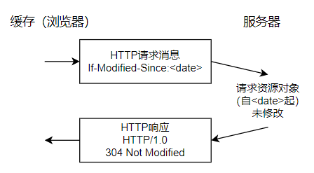

# Learning_Java_08_复习
### HTTP 状态码

 

HTTP状态码
 

### HTTP VS HTTPS

    - 端口号 http：80 https：443
    - url http://  ｜  https://
    - tcp 明文传输  ｜  加密传输SSL/TLS 非对称加密加密公钥、对称加密加密信息
    - 消耗资源少    ｜  消耗资源多

### HTTP 缓存机制

    强缓存：服务器端使用Expires标签来标志（时间）一个响应体，在Expires标志时间内的请求，都会获得该响应体缓存，而无需再发送HTTP请求。

    协商缓存：资源过期时，在请求头中，使用If-Modified-Since标签，该标签标志一个时间，意为客户端向服务器进行问询：“该时间之后，我要请求的资源是否有被修改过？”服务器返回304: Not Modified表示缓冲可用。否则返回新的数据。

协商缓存
 

### HTTP 1.0/1.1/2.0
    HTTP 1.0
        -   默认使用短连接，每访问一个Web资源就会重新建立连接。
        -   必须等上一个请求响应完毕才能发下一个请求。
       
    HTTP 1.1
        -   默认使用长连接。
        -   采用管道技术，不必等上一个请求的响应就能发下一个请求。
        -   支持范围发送
        -   请求头部加入HOST字段，支持一个IP多个域名。

    HTTP 2.0
        -   支持头部压缩，发收双方维护一张头信息表，所有字段都生成索引，这样只用发索引号即可。
        -   不使用纯文本格式发送，而是使用二进制格式。
        -   多路复用，并发多个请求或者回复，不用按顺序一一对应。
        -   服务器会主动提前推送一些内容，以减少延时等待。

### MySQL

#### 数据类型

 

MySQL 数据类型
 

    **整形的UNSIGNED：**
    -  TINYINT、SMALLINT、MEDIUMINT、INT 和 BIGINT；
    -  将数字表示范围提升到从0开始，例如-128～127 提升到 0～255；

    **char varchar：**
    -   char为定长字符串, char(n)变量，不足n的会用空格补充，长度不能超过n；
    -   varchar为变长字符串,varchar(n)变量，不会使用空格填充，查询效率不如char但是占内存空间小，长度同样不能超过n；

    **DECIMAL/FLOAT/DOUBLE**
    -   DECIMAL：它以字符串形式存储数值，包括每个数字的位置，因此可以表示精确的小数值，不会有任何精度损失。
    -   FLOAT/DOUBLE 用于存储近似值的浮点数。这些类型使用二进制表示浮点数，因此在某些情况下可能会引入舍入误差.

    **为什么不推荐使用 TEXT 和 BLOB：**
    -  TEXT 类型类似于 CHAR（0-255 字节）和 VARCHAR（0-65,535 字节），但可以存储更长的字符串，即长文本数据，例如博客内容
    -   缺点：检索效率较低。不能直接创建索引，需要指定前缀长度，查找效率变慢。

    **DATETIME 和 TIMESTAMP**
    -   DATETIME（8字节）：1000-01-01 00:00:00 ~ 9999-12-31 23:59:59
    -   Timestamp（4字节）：1970-01-01 00:00:01 ~ 2037-12-31 23:59:59

    **NULL 和 '' 的区别是什么:**
    -   NULL 表示缺少值或未知值。它不是一个空字符串，而是一个占位符，用于表示数据缺失或不适用,NULL 不能与其他值进行直接比较.例如，SELECT NULL=NULL的结果为 false，但是在我们使用DISTINCT,GROUP BY,ORDER BY时,NULL又被认为是相等的。所以不建议默认值采用NULL。
    -   '' 表示一个空的字符串，它是一个有效的字符串，但其长度为零。它不同于 NULL，因为它是一个字符串值，只是没有任何字符.

#### MySQL 框架

MySQL 框架 
 

 

    -   连接器： 身份认证和权限相关(登录 MySQL 的时候)。
    -   查询缓存： 执行查询语句的时候，会先查询缓存（MySQL 8.0 版本后移除，因为这个功能不太实用）。
    -   分析器： 没有命中缓存的话，SQL 语句就会经过分析器，分析器说白了就是要先看你的 SQL 语句要干嘛，再检查你的 SQL 语句语法是否正确。
    -   优化器： 按照 MySQL 认为最优的方案去执行。
    -   执行器： 执行语句，然后从存储引擎返回数据。 执行语句之前会先判断是否有权限，如果没有权限的话，就会报错。
    -   插件式存储引擎：主要负责数据的存储和读取，采用的是插件式架构，支持 InnoDB、MyISAM、Memory 等多种存储引擎。

#### MyISAM和InnoDB引擎对比：

    1.是否支持行级锁

    MyISAM 只有表级锁(table-level locking)。
    InnoDB 支持行级锁(row-level locking)和表级锁,默认为行级锁。

    2.是否支持事务

    MyISAM 不提供事务支持。
    InnoDB 提供事务支持，实现了 SQL 标准定义了四个隔离级别，具有提交(commit)和回滚(rollback)事务的能力。并且，InnoDB 默认使用的 REPEATABLE-READ（可重读）隔离级别是可以解决幻读问题发生的（基于 MVCC 和 Next-Key Lock）

    3.是否支持外键
    MyISAM 不支持，而 InnoDB 支持。外键对于维护数据一致性非常有帮助，但是对性能有一定的损耗。因此，通常情况下，我们是不建议在实际生产项目中使用外键的，在业务代码中进行约束即可！

    4.是否支持数据库异常崩溃后的安全恢复
    MyISAM 不支持，而 InnoDB 支持。
    使用 InnoDB 的数据库在异常崩溃后，数据库重新启动的时候会保证数据库恢复到崩溃前的状态。这个恢复的过程依赖于 redo log 。

#### MySQl日志：

    

