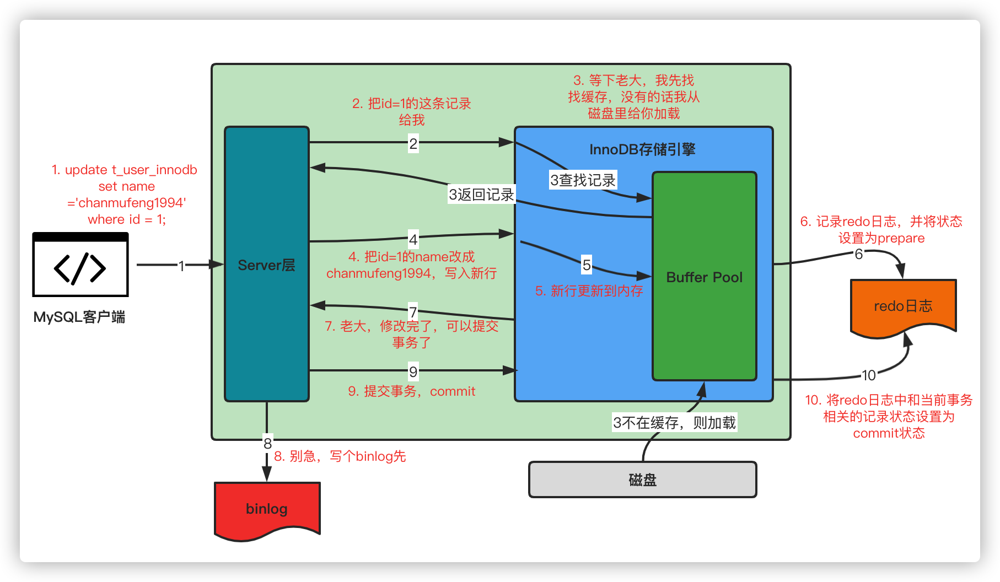

# Learning_Java_10

### MySQL如何实现各种隔离级别的
    -   读未提交 什么都不做
    -   读已提交： 普通读（快照读）操作使用MVCC，当前读（for update、in share mode、update、delete、insert）加锁。
    -   可重复读：同读已提交，只不过ReadView处理方式不一样。
    -   串行化   读操作都加S锁，写操作加X锁，直到事务结束。

    https://www.xiaolincoding.com/mysql/transaction/mvcc.html#%E5%8F%AF%E9%87%8D%E5%A4%8D%E8%AF%BB%E6%98%AF%E5%A6%82%E4%BD%95%E5%B7%A5%E4%BD%9C%E7%9A%84

### MySQL 主从复制原理
    负载均衡：主服务器用做写操作、从服务器用做读操作。可以一主多从或者一主一丛。
    主从服务器复制时机：等从机全部复制完毕才能提交事务（主机宕机时不会出现数据不一致，耗时长）、等一个从机复制完即可提交事务（时间和安全做了中和）、异步复制（耗时短，但是可能不安全），延时复制（选择一定的时间内去复制）。
    主从服务器复制方式：语句复制（重新执行一下主机的SQL操作即可，延迟短、效率高，但是有些语句会涉及时间等，可能会导致出错。）、行数据复制（把该改动的数据发过去）。混合复制（优先使用语句复制、语句复制失效时使用行数据复制）。
    复制步骤：从机读取主机的bin log 复制到本地的relay log，然后根据relay log的内容去执行。

### MySQL 分页查询 大数据优化
    https://dbaplus.cn/news-11-4844-1.html
    https://heapdump.cn/article/4254507
    select * from table where a >10 limit M N  (M=10000000)
    在执行此操作时，会插叙M+N个数据，然后再丢掉前M个就保留N个出来，回表次数太多，导致耗时过长，优化手段：
        采用子查询：先找到a>10的第M个数的主键id再去主表中查询即可，这样不用每次都回表了。

### 一条update 语句 执行时redo log 和 bin log

update
 

### select * from A join B on A.id = B.id;执行过程性能差，原因可能是？哪里需要建立索引?
    需要给id做索引，而且是给小表的id做索引。假如A有N条数据、B有M条数据，那么查询时，不建立索引需要N*M次匹配。对B的id建立索引，然后从遍历A表借助B的索引去判断是否存在id，只需要N*logM的时间复杂度。

### 分库分表
https://juejin.cn/post/7033657769538371615

### 缓存雪崩
    看起来名字高大上，其实就是大量的请求无法在 Redis 缓存系统中处理，请求全部打到数据库，导致数据库压力激增，甚至宕机

    出现该原因主要有两种：

    大量热点数据同时过期，导致大量请求需要查询数据库并写到缓存
    Redis 宕机，缓存系统异常。

    1）大量热点数据同时过期：

    给过期时间添加随机值：避免给大量的数据设置一样的过期时间，过期时间 = baes 时间+ 随机时间(较小的随机数，比如随机增加 1~5 分钟)。这样一来，就不会导致同一时刻热点数据全部失效，同时过期时间差别也不会太大，既保证了相近时间失效，又能满足业务需求。
    接口限流：当流量到达一定的阈值时，就直接返回 “系统拥挤” 之类的提示，防止过多的请求打在数据库上。至少能保证一部分用户是可以正常使用，其他用户多刷新几次也能得到结果
    2）Redis 宕机：

    保证缓存层服务高可用性：比如 Redis Sentinel 和 Cluster
    提高数据库的容灾能力，可以使用分库分表，读写分离的策略

### Redis缓存
    Redis 的六大底层数据结构：

    整数集合 intset：底层实现是 int8_t contents[]。详细可参考 https://itmtx.cn/question/364
    简单动态字符串 SDS：底层实现是 char buf[]。详细可参考 https://itmtx.cn/question/363
    字典 dict。详细可参考 https://itmtx.cn/question/365
    链表(双端链表) list
    压缩列表 ziplist。详细可参考 https://itmtx.cn/question/366
    跳跃表 skiplist。详细可参考 https://itmtx.cn/question/367

### 过期键
    如何知道键是过期的？
    redisDb 结构的 expires 字典保存了数据库中所有键的过期时间。

    过期键的删除策略
    过期键的删除策略主要有三种：

    1）定时删除（立即删除）：在设置键的过期时间的同时，创建一个定时器（timer），让定时器在键的过期时间来临时，立即执行对键的删除操作（简单记忆，过期时间一到就立马删除）

    优点：内存友好
    缺点：CPU 时间不友好
    2）惰性删除：放任键过期不管，但是每次从键空间中获取键时，都检查取得的键是否过期，如果过期的话，就删除该键；如果没有过期，就返回该键

    优点：CPU 时间友好
    缺点：内存不友好
    3）定期删除：每隔一段时间，程序就对数据库进行一次检查，删除里面的过期键。至于要删除多少过期键，以及要检查多少个数据库，则由算法决定

### Redis是多线程还是单线程的

