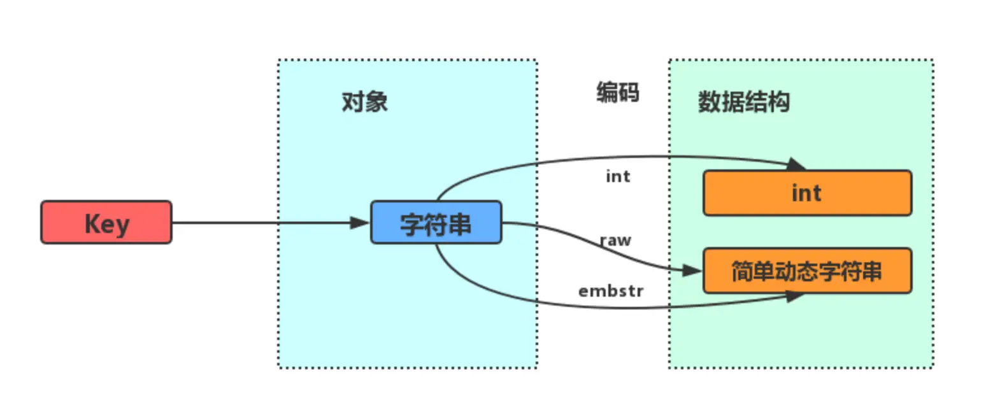
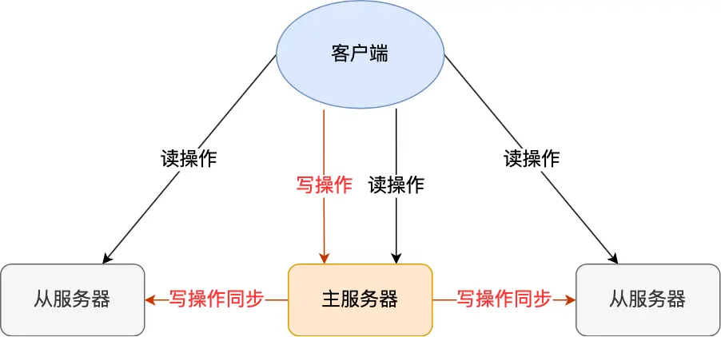

# Learning_Java_10

### Redis String 底层存储原理

<div style="text-align:center;">
string
<br>

</div>

如果一个字符串保存的是整型值，并且这个值可以用long表示，那么底层会使用int类型进行编码。
<div style="text-align:center;">
int
<br>

</div>

如果存放的是一个字符串，或者float double类型的浮点数，并且长度小于32字节，会使用简单动态字符串SDS来保存，编码方式为embstr。
<div style="text-align:center;">
embstr
<br>

</div>

当存放的字符串长度超过32字节，就使用SDS方式存储，编码方式为raw。

    使用场景：
    -   存储对象的json格式
    -   计数器
    -   共享session
    -   分布式锁 使用键值对保存锁变量，
        使用SET key value[EX seconds][PX milliseconds][NX|XX]来实现加锁
        EX seconds：设定过期时间，单位为秒
        PX milliseconds：设定过期时间，单位为毫秒
        NX：仅当 key 不存在时设置值
        XX：仅当 key 存在时设置值
        set 命令的 nx 选项，就等同于 setnx 命令
        锁过期时间的设置需要结合实际情况考虑，同时也要判断加解锁是否是同一个对象，lua脚本保证原子性。
        基于多个 Redis 节点实现分布式锁
官方文档：https://redis.io/docs/reference/patterns/distributed-locks/

以上，我们只用了一个 Redis 实例来保存锁变量，如果这个 Redis 实例发生故障宕机了，那么锁变量就没有了。此时，客户端也无法进行锁操作了，这就会影响到业务的正常执行。所以，我们在实现分布式锁时，还需要保证锁的可靠性，这就要提到基于多个 Redis 节点（集群）实现分布式锁的方式了。

为了避免 Redis 实例故障而导致的锁无法工作的问题，Redis 的开发者 Antirez 提出了【分布式锁算法 Redlock】。

Redlock 算法的基本思路，是让客户端和多个独立的 Redis 实例依次请求加锁，如果客户端能够和【半数以上】的实例成功地完成加锁操作，那么我们就认为，客户端成功地获得分布式锁了，否则加锁失败。

这样一来，即使有单个 Redis 实例发生故障，因为锁变量在其它实例上也有保存，所以，客户端仍然可以正常地进行锁操作，锁变量并不会丢失。

我们来具体看下 Redlock 算法的执行步骤。Redlock 算法的实现需要有 N 个独立的 Redis 实例。接下来，我们可以分成 3 步来完成加锁操作：

1）客户端获取当前时间

2）第二步是，客户端按顺序依次向 N 个 Redis 实例执行加锁操作。这里的加锁操作和在单实例上执行的加锁操作一样，使用 SET 命令，带上 NX，EX/PX 选项，以及带上客户端的唯一标识。

如果某个 Redis 实例发生故障了，为了保证在这种情况下，Redlock 算法能够继续运行，我们需要给加锁操作设置一个超时时间。如果客户端在和一个 Redis 实例请求加锁时，一直到超时都没有成功，那么此时，客户端会和下一个 Redis 实例继续请求加锁。加锁操作的超时时间需要远远地小于锁的有效时间，一般也就是设置为几十毫秒。

3）一旦客户端完成了和所有 Redis 实例的加锁操作，客户端就要计算整个加锁过程的总耗时。客户端只有在满足下面的这两个条件时，才能认为是加锁成功：

条件一：客户端从超过半数（大于等于 N/2+1）的 Redis 实例上成功获取到了锁
条件二：客户端获取锁的总耗时没有超过锁的有效时间
在满足了这两个条件后，我们需要重新计算这把锁的有效时间，计算的结果是锁的最初有效时间减去客户端为获取锁的总耗时。如果锁的有效时间已经来不及完成共享数据的操作了，我们可以释放锁，以免出现还没完成数据操作，锁就过期了的情况。

如果客户端在和所有实例执行完加锁操作后，没能同时满足这两个条件，那么，客户端向所有 Redis 节点发起释放锁的操作。

这样一来，只要 N 个 Redis 实例中的半数以上实例能正常工作，就能保证分布式锁的正常工作了。所以，在实际的业务应用中，如果你想要提升分布式锁的可靠性，就可以通过 Redlock 算法来实现。

### 如何解决缓存和数据库一致性问题：
    1.先更新数据库 再删缓存。
    为了保证两步都做完，需要配合消息队列或订阅日志完成，同时延迟双删。

    2.先删缓存，再更新数据库，高并发时会出现不一致的情况，采用延迟双删，但是延迟时间很难评估。


### List底层原理
    底层实现：基于C语言的quicklist本质上还是链表只不过做了优化。
    按照插入顺序排序，可以从头部或者尾部插入或者删除。
    使用场景：
        -   消息队列：消息保序：使用 LPUSH + RPOP；
                    阻塞读取：使用 BRPOP；
                    重复消息处理：生产者自行实现全局唯一 ID；
                    消息的可靠性：使用 BRPOPLPUSH


### Hash底层原理
    hash表，他与string类型的区别：
<div style="text-align:center;">
hash
<br>

</div>
    使用场景：- 缓存对象，通常使用string + json如果属性频繁变化可以考 虑使用hash
            -  购物车：用户id；商品id；商品数量。

### Set底层实现
    hash表或者整数集合（元素都是整数且少于512个）
    无序、不可重复
    使用场景：点赞key为文章id，value为用户id，一个key包含多个不同的用户id。

### Zset
<div style="text-align:center;">
zset
<br>

</div>

    底层使用跳表实现。
    使用场景：排行榜。    

### bitMap
    位图，底层使用string作为数据结构来实现的一种统计二值状态的数据类型。
    使用场景：签到统计、用户登陆状态。


### Redis 两种持久化方案
    AOF 日志：每执行一条写操作命令，就把该命令以追加的方式写入到一个文件里；
    RDB 快照：将某一时刻的内存数据，以二进制的方式写入磁盘；
    混合持久化方式：Redis 4.0 新增的方式，集成了 AOF 和 RBD 的优点；

<div style="text-align:center;">
AOF
<br>


</div>

为什么先执行命令，再把数据写入日志呢？

Reids 是先执行写操作命令后，才将该命令记录到 AOF 日志里的，这么做其实有两个好处。

避免额外的检查开销：因为如果先将写操作命令记录到 AOF 日志里，再执行该命令的话，如果当前的命令语法有问题，那么如果不进行命令语法检查，该错误的命令记录到 AOF 日志里后，Redis 在使用日志恢复数据时，就可能会出错。
不会阻塞当前写操作命令的执行：因为当写操作命令执行成功后，才会将命令记录到 AOF 日志。

<div style="text-align:center;">
AOF写回策略
<br>

</div>

所以，Redis 为了避免 AOF 文件越写越大，提供了 **AOF 重写机制**，当 AOF 文件的大小超过所设定的阈值后，Redis 就会启用 AOF 重写机制，来压缩 AOF 文件。

AOF 重写机制是在重写时，读取当前数据库中的所有键值对，然后将每一个键值对用一条命令记录到「新的 AOF 文件」，等到全部记录完后，就将新的 AOF 文件替换掉现有的 AOF 文件。

举个例子，在没有使用重写机制前，假设前后执行了「set name xiaolin」和「set name xiaolincoding」这两个命令的话，就会将这两个命令记录到 AOF 文件。
<div style="text-align:center;">
AOF写回策略
<br>

</div>

    RDB快照
    因为 AOF 日志记录的是操作命令，不是实际的数据，所以用 AOF 方法做故障恢复时，需要全量把日志都执行一遍，一旦 AOF 日志非常多，势必会造成 Redis 的恢复操作缓慢。

    为了解决这个问题，Redis 增加了 RDB 快照。所谓的快照，就是记录某一个瞬间东西，比如当我们给风景拍照时，那一个瞬间的画面和信息就记录到了一张照片。

    所以，RDB 快照就是记录某一个瞬间的内存数据，记录的是实际数据，而 AOF 文件记录的是命令操作的日志，而不是实际的数据。

    因此在 Redis 恢复数据时， RDB 恢复数据的效率会比 AOF 高些，因为直接将 RDB 文件读入内存就可以，不需要像 AOF 那样还需要额外执行操作命令的步骤才能恢复数据


### Redis集群

    主从复制、哨兵模式、切片集群。
    类似于MySQL集群部署，redis也采用同样的部署方式：一主多从。并且读写分离。
<div style="text-align:center;">
Redis集群
<br>

</div>

具体来说，在主从服务器命令传播阶段，主服务器收到新的写命令后，会发送给从服务器。但是，主服务器并不会等到从服务器实际执行完命令后，再把结果返回给客户端，而是主服务器自己在本地执行完命令后，就会向客户端返回结果了。如果从服务器还没有执行主服务器同步过来的命令，主从服务器间的数据就不一致了。

所以，无法实现强一致性保证（主从数据时时刻刻保持一致），数据不一致是难以避免的。

    哨兵模式：
    主机宕机，怎么办？为了解决这个问题，Redis 增加了哨兵模式（Redis Sentinel），因为哨兵模式做到了可以监控主从服务器，并且提供主从节点故障转移的功能。

<div style="text-align:center;">
哨兵模式
<br>

</div>


### Java序列化

    -   对象在进行网络传输（比如远程方法调用 RPC 的时候）之前需要先被序列化，接收到序列化的对象之后需要再进行反序列化；
    -   将对象存储到文件之前需要进行序列化，将对象从文件中读取出来需要进行反序列化；
    -   将对象存储到数据库（如 Redis）之前需要用到序列化，将对象从缓存数据库中读取出来需要反序列化；
    -   将对象存储到内存之前需要进行序列化，从内存中读取出来之后需要进行反序列化。


### 为什么说公平锁没有非公平锁性能高
    AQS 使用了一个 volaitle 修饰的【int 成员变量 state】表示同步状态/锁（比如说当前有一个线程，调用 lock() 方法进行加锁，这个加锁的过程，其实就是通过 CAS 自旋 将 state 变量的值增加 1，释放锁操作就是将 state 的变量减 1，底层对应的方法就是 AQS 的 compareAndSetState），通过内置的【 FIFO 双向队列】（源码注释上写的 CLH（Craig，Landin，and Hagersten） 队列，三个人名的简称，其实就是一个先进先出的双向队列）来完成线程们获取资源的时候的排队工作。

    具体来说，如果某个线程请求锁（共享资源）失败，则该线程就会被加入到 CLH 队列的「末端」。当持有锁的线程释放锁之后，会唤醒其后继节点，这个后继节点就可以开始尝试获取锁。

    -   当有线程释放了锁之后，state = 0，等待锁的线程会被随机唤醒，载入cpu运行，如果是非公平锁，那么这个线程可以立马获取到锁进行下一步操作，如果是公平锁，还应判断当前线程是否是CLH等待队列的第一个，是的话才会把锁给他，不然就不给运行，cpu又会切换上下文浪费了时间。

### MarkWord 锁升级
<div style="text-align:center;">
MarkWord（对象头部信息的一部分）
<br>

</div>


### JMM（Java内存模型）
<div style="text-align:center;">
JMM
<br>

</div>

Java 内存模型（Java Memory Model，JMM）抽象了线程和主内存之间的关系，设计 JMM 的目的就是为了屏蔽各种硬件和操作系统的内存访问差异，以实现让 Java 程序在各种平台下都能达到一致的内存访问效果。

JMM 规定了所有的变量都存储在主内存（Main Memory）中，每条线程还有自己的工作内存（Working Memory）

线程的工作内存中保存了被该线程使用的变量的【主内存副本】，线程对变量的所有操作（读取、赋值等）都必须在工作内存中进行，而不能直接读写主内存中的数据。

Java 内存三大性质：原子性、可见行、有序性。

### 逃逸分析
    逃逸分析（Escape Analysis）简单来讲就是，Java Hotspot 虚拟机可以分析新创建对象的**使用范围**，并决定是否在 Java 堆上分配内存的一项技术。

    -   方法逃逸
    当一个对象在方法里面被定义后，它如果被外部方法所引用（例如作为调用参数传递到其他方法中），这种称为方法逃逸；
    -   线程逃逸
    可能被外部其他线程访问到，譬如赋值给可以在其他线程中访问的实例变量，这种称为线程逃逸；例如this逃逸：
```java
    public class FinalReferenceEscapeTest {    
	final int i;    
	static FinalReferenceEscapeTest obj;    
	public FinalReferenceEscapeTest () {        
		i = 1;                   // 1. 写 final 域
		obj = this;              // 2. this 引用在此 "逸出"
	} 

// 线程 A
	public static void writer() { 
		new FinalReferenceEscapeExample(); 
	} 

// 线程  B
	public static void reader() { 
		if (obj != null) {      // 3 
			int temp = obj.i;   // 4 
		} 
	}
}
```
<div style="text-align:center;">
this 逃逸
<br>

</div>

    由于指令可能会重排序，导致构造函数还未执行完毕，this还未被完全初始化，就将其赋值给了obj，其他线程获得obj再进行操作时，就会发生异常。

    如果虚拟机能够确定一个对象不会发生方法逃逸和线程逃逸，或者逃逸程度比较低（只发生方法逃逸，不发生线程逃逸），则（JIT 即时编译器）可以为这个对象实例采取不同程度的优化，比如锁消除 Lock Elimination（也称为 “同步消除 Synchronization Elimination”）、还有 栈上分配（Stack Allocations） 和 标量替换（Scalar Replacement）等。

    -   锁清除
    如果 JIT 即时编译器认定一个锁只会被单个线程访问，那么这个锁就可以被消除。结合逃逸分析来看锁消除，其实就是，如果虚拟机能够确定一个变量（锁对象）不会发生线程逃逸（或者说不发生逃逸 or 逃逸程度较低 - 只发生方法逃逸），即无法被其他线程访问，那么这个变量的读写肯定就不会有竞争，对这个变量实施的同步措施也就可以安全地消除掉了。
    例如使用字符串+进行拼接，会自动将StringBuffer上的synchronized锁清楚。
    -   栈上分配
```Java
    void fun(){
        Point p = new Point();  //p对象分配在栈上
        p.x = 1;
        p.y = 2;
    }
```
    栈上分配（Stack Allocations）是 JIT 即时编译器的一项优化技术：如果确定一个对象不会逃逸出线程之外（不发生逃逸或逃逸程度较低 - 方法逃逸），那让这个对象在栈（线程私有）上分配内存将会是一个很不错的主意，对象所占用的内存空间就可以随栈帧出栈而销毁。

    在一般应用中，完全不会逃逸的局部对象和不会逃逸出线程的对象所占的比例是很大的，如果能使用栈上分配，那大量的对象就会随着方法的结束而自动销毁了，垃圾收集子系统的压力将会下降很多。

    -   标量替换

    逃逸分析证明一个对象不会被外部访问（不会发生线程逃逸），如果这个对象可以被拆分的话，当程序真正执行的 时候可能不创建这个对象，而直接创建它的成员变量来代替。将对象拆分后，可以分配对象 的成员变量在栈或寄存器上，原本的对象就无需分配内存空间了。这种编译优化就叫做标量替换。

```java
    public void foo() {
     TestInfo info = new TestInfo();
     info.id = 1;
     info.count = 99;
     ...//to do something
 }

    //优化后
    public void foo() {
    id = 1;
    count = 99;
    ...//to do something
 }
```


### Java如何保证原子性

    JMM 提供的 8 种原子操作（主内存到工作内存的一些操作）
    锁（Java 语言层面的锁 synchronized 和类库层面的锁 Lock）
    无锁（CAS）： sun.misc.Unsafe 类里面的 compareAndSwapInt() 和 compareAndSwapLong() 

### Java线程池状态

<div style="text-align:center;">
this 逃逸
<br>

</div>

### 守护线程
    Java 把线程分成两类：用户线程（User Thread） + 守护线程（Daemon Thread）

    守护线程的使用有以下要点：

    当程序中所有的用户线程执行完毕之后，不管守护线程是否结束，系统都会自动退出（也就是说只要存在一个用户线程在允许，守护线程就不会结束）
    守护线程必须在 start 启动前通过 setDaemon() 方法将状态设置为 true，启动后就不能进行设置，否则报 InterruptedException 异常
    守护线程存在被 JVM 强制终止的风险，所以在守护线程中尽量不去访问系统资源，例如打开文件等，因为虚拟机退出时，守护线程没有任何机会来关闭文件，这会导致数据丢失，所以守护线程适合执行无需完整执行的后台任务。
    守护线程中创建的线程也是守护线程
    JVM 进程中的 GC 线程就是一个守护线程，这样设计目的很明确，当你所有的程序都执行完毕了，留着这个 GC 线程就没有任何意义了。反过来可以设想，如果把 GC 线程设计成非守护线程，当你明确你的程序都执行完毕了，但是就是不自动退出岂不是很奇怪？

### ArrayBlockingQueue 和LinkedBlockingQueue

    前者底层使用Object[]数组+循环双指针，使用一把锁来控制生产和消费。
    后者底层使用列表，分别对生产和消费使用两把锁，意味着同一时刻可能有两个线程在操作。使用AtomicInteger来记录队列中的元素数量。


### LockSupport 
    线程阻塞工具类 LockSupport（park和unpark），LockSupport 类可以在任何地方阻塞当前线程以及唤醒指定被阻塞的线程,无需获取锁（例如synchronized和ReentrantLock都需要获取锁在调用notify /signal等，顺序也不能出错）。

    LockSupport 所有的方法都是静态方法，主要有两类方法：park 和 unpark。

### 主从复制原理
    主从复制的原理就是 binlog 同步。

    一个 binlog 同步的完整过程是这样的：

    在备库上通过 change master 命令，设置主库的 IP、端口、用户名、密码，以及要从哪个位置开始请求 binlog，这个位置包含文件名和日志偏移量
    在备库上执行 start slave 命令，这时候备库会启动两个线程，io_thread 和 sql_thread。其中 io_thread 负责与主库建立连接
    主库校验完用户名、密码后，开始按照备库传过来的位置，从本地读取 binlog，发给备库
    备库拿到 binlog 后，写到本地文件，称为中转日志（relay log）
    sql_thread 读取中转日志，解析出日志里的命令，并执行。

### 优化MySQL
    分库分表：将一个大表按照一定的规则进行拆分，分散到不同的物理数据库或表中，以减轻单一数据库或表的读写压力，提高整体的读写效率。使用分库分表需要考虑到数据一致性、事务处理、跨库查询等问题，需要根据具体的业务场景进行选择。

    读写分离：读写分离是一种将读操作和写操作分离的优化方式，将读操作分配到从服务器，将写操作分配到主服务器。这种方式能够有效减轻单一数据库的读写压力，提高整体的读写效率。在实现读写分离时，需要考虑到主从同步延迟、数据一致性、跨服务器事务处理等问题，需要使用相应的技术手段进行解决。

    缓存：缓存是一种常用的优化 MySQL 读写效率的方式，可以将常用的数据放入缓存中，以减轻数据库的读写压力。常用的缓存技术包括 Memcached、Redis 等。在使用缓存时，需要考虑到缓存的一致性问题，使用缓存更新策略来保证数据的一致性。

    索引优化：索引是一种优化 MySQL 查询效率的重要方式，能够大幅度提高查询效率。需要根据具体的查询场景和数据结构来选择合适的索引类型，尽量减少无用索引的存在，以避免降低写操作的效率。同时，需要注意索引的维护和更新，以避免索引失效。

    SQL 语句优化：SQL 语句的优化也是提高 MySQL 读写效率的重要手段。需要避免使用过于复杂的查询语句，尽量减少子查询和临时表的使用，优化连接方式和连接顺序等。同时，需要注意 SQL 语句中参数的使用和绑定，以提高查询效率

    优化表结构：可以通过优化表结构来提高 MySQL 的读写效率。例如：

    合理拆分大表（垂直拆分和水平拆分）
    优化数据类型：应该尽量使用较小的数据类型，例如使用 TINYINT 代替 INT、使用 VARCHAR 代替 CHAR 等。这可以减少磁盘空间的使用，从而提高查询性能。
    建立正确的关系：应该尽量避免使用外键约束，因为外键约束会导致插入和更新操作的性能下降。同时，应该尽量使用连接表来代替嵌套查询，因为连接表可以提高查询性能。

### 为什么不使用红黑树或者跳表
    为什么不用红黑树
    在数据库中，B+ 树比红黑树更适合作为索引数据结构。这主要是因为以下几个方面的原因：

    磁盘 I/O 友好性：B+ 树相对于红黑树来说，每个节点能够存储更多的关键字和数据指针，这意味着在同样的数据规模下，B+ 树的高度更低，因此每次查询时需要访问的磁盘块数也更少。在数据库查询中，磁盘 I/O 是很耗时的操作，使用 B+ 树可以带来更快的查询速度。

    支持范围查询：在数据库查询中，经常需要进行范围查询，例如查找某个时间段内的所有记录，或者查找某个区间内的记录。B+ 树能够支持这种范围查询，因为 B+ 树中叶子节点是按照关键字的大小顺序进行排序的，因此可以方便地通过遍历叶子节点来获取一个区间内的所有记录。

    顺序访问性：在数据库查询中，经常需要按照某个列进行排序，或者对某个列进行分组聚合操作。B+ 树能够很好地支持这种顺序访问性，因为它的叶子节点是按照关键字的大小顺序进行排序的，可以方便地按顺序访问。

    磁盘空间利用率：B+ 树相对于红黑树来说，每个节点存储的数据更多，因此它在磁盘空间的利用率更高。在数据库中，通常需要处理海量数据，因此优化磁盘空间利用率对于提高系统的性能也是非常重要的。

    为什么不用跳表
    虽然跳表也能够支持范围查询和顺序访问，但是相对于 B+ 树来说，其磁盘空间利用率和磁盘 I/O 友好性较差，并且跳表的实现比较复杂，因此并不适合作为数据库索引的实现方式。

### 意向锁
**意向锁与表级读写锁之间大部分都是不兼容的，意向锁不会与行级的读写锁互斥！！！**
    行级锁只在存储引擎层实现。InnoDB 存储引擎的行级锁是基于索引的，也就是说当**索引失效或者说根本没有用索引的时候**，**行锁就会升级成表锁**。

    这也就解释了为什么两个事务update同一范围的数据会出现问题。虽然都给同一张表加了意向独占锁，但是由于他们之间是兼容的，因此并不会阻塞对方的操作。同样的，间隙锁之间也是相互兼容的。