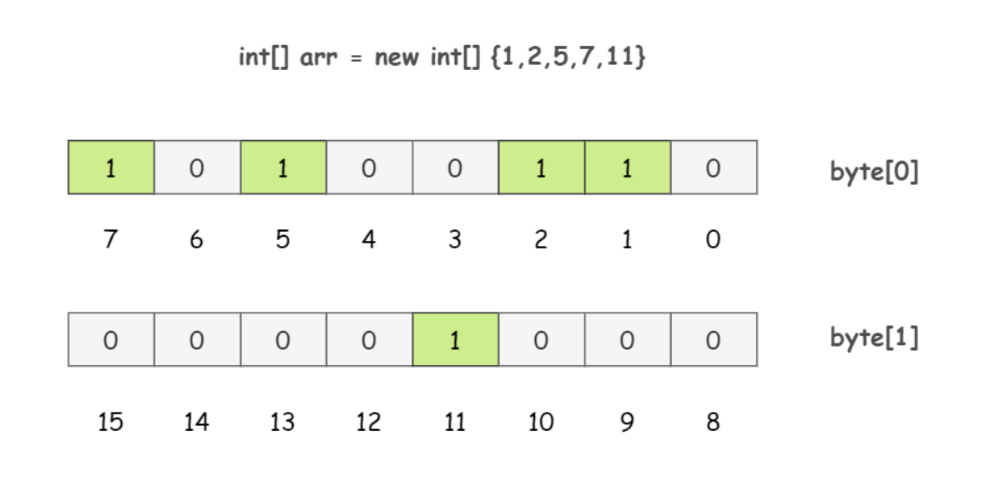

# Learning_Java_12

### 1. 如何对大内存数据100亿条进行排序
    -   分治法 + 堆
        先将数据分为多个小数据，将多个小数据内部进行排序；选择一定大小的堆，然后依次将小数据的第一个元素放入堆中，取走堆顶部的元素，然后看其属于哪一个小数据，再继续从该小数据取出元素。重复此番操作直到所有元素排序完毕。
    
    -   位图法
        如果待排序的文件是由数字组成的，可以使用一个bit来代表数字是否出现。一个字节可以表示8个数字，这样1MB大小空间可以表示约800万的数字。

位图法
 

### 2. 如何判断某网页的 URL 是否存在于包含 100 亿条数据的黑名单上，要求误判率不能超过一定值，内存大小不能超过一定值
    解决方法：布隆过滤器，使用多个hash函数将数据映射到位图上面，如果全部都存在，则可以判定位于黑名单上，只要有一个不存在则不存在。

### 3. 糊涂窗口综合症
    糊涂窗口综合症（Silly Window Syndrome, SWS）就是接收方窗口变小，导致发送方每次发送的数据只有一个大大的首部，真正携带的数据很少。
    解决办法：
    接收方：
    方案 1：只要窗口大小（接收缓冲区中的可用空间大小） < Min(MSS, 接收缓冲区大小的一半) 的时候，就直接将窗口大小设置为 0，防止发送方发送小数据；然后等到窗口大小 >= MSS or 接收缓冲区中有一半空间可用 的时候，才打开窗口，通告发送方，告知其可以发送数据。这样就可以防止发送方发送小报文了

    方案 2（延迟确认应答）：延迟确认应答其实是针对如果接受数据的主机在接收到报文的时候就立刻返回 ACK 应答的话，这时候返回的窗口可能比较小。如果接收方稍微等一会再应答，那么这个时候接收的数据已经被处理完了，从缓冲区中被清理出去了，这样的话，窗口就变大了，发送方能够发送的数据也就更多了

    发送方
    Nagle 算法：指发送端即使还有应该发送的数据，但如果这部分数据很少的话，则进行延迟发送的一种处理机制。具体来说，当满足已发送的数据都已经收到确认应答时；或者可以发送的数据大小 >= MSS 时，才可以发送数据。这样，从发送方的角度去防止了小报文的发送。

### 4.Cookie 和Session
    既然服务端是根据 Cookie 中的信息来进行判断，那么如果浏览器中禁止了 Cookie，如何记录状态信息？

    第一种方案，URL 重写：每次请求中都携带一个 SessionID 的参数，也可以在请求的地址后面拼接 xxx?SessionID=123456...
    第二种方案，Token 机制。Token 的意思是“令牌”，是服务端将所需要的信息经过编码后生成的一串字符串（比如用户登录状态，可以把用户名用、登录失效时间等等信息放在一起然后编码），作为客户端进行请求的一个标识。当用户第一次登录后，服务器根据提交的用户信息生成一个 Token，响应时将 Token 返回给客户端，以后客户端只需带上这个 Token 前来请求数据即可（服务端可直接分析这个 Token 来获取状态），无需再次登录验证。

### 5.禁用Cookie怎么办
    既然服务端是根据 Cookie 中的信息来进行判断，那么如果浏览器中禁止了 Cookie，如何记录状态信息？

    第一种方案，URL 重写：每次请求中都携带一个 SessionID 的参数，也可以在请求的地址后面拼接 xxx?SessionID=123456...
    第二种方案，Token 机制。Token 的意思是“令牌”，是服务端将所需要的信息经过编码后生成的一串字符串（比如用户登录状态，可以把用户名用、登录失效时间等等信息放在一起然后编码），作为客户端进行请求的一个标识。当用户第一次登录后，服务器根据提交的用户信息生成一个 Token，响应时将 Token 返回给客户端，以后客户端只需带上这个 Token 前来请求数据即可（服务端可直接分析这个 Token 来获取状态），无需再次登录验证。

